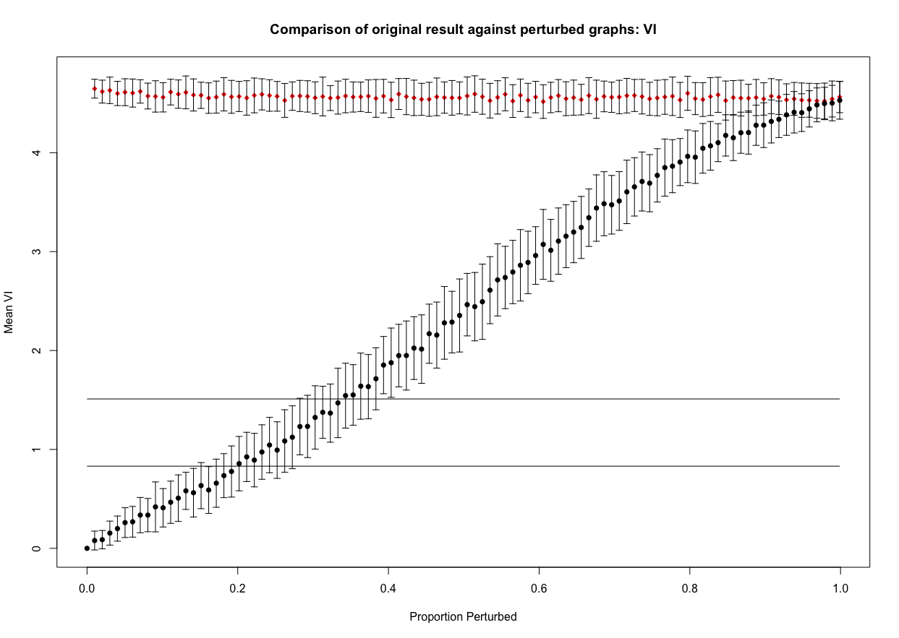
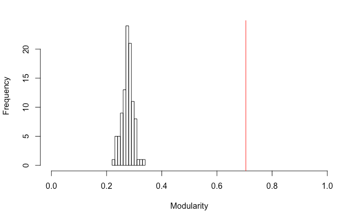

```{r, echo = FALSE}
library(perturbR)
```

# <tt>perturbR</tt> 

<tt>perturbR</tt> is an <tt>R</tt> package for evaluating cluster solutions. <tt>perturbR</tt> can be used to make comparisons between (1) the solution obtained from the original matrix to solutions obtained in matrices that have had their edge weights incrementally perturbed; and (2) a relative quality score obtained from the original solution and the distribution of quality values obtained from random matrices.  

# Getting Started with <tt>perturbR</tt> 

When describing the use of the package we utilize publicly available [benchmark data](https://dataverse.unc.edu/dataset.xhtml?persistentId=doi:10.15139/S3/1234) that have previously been evaluated (see Gates et al., 2016). For the purposes of demonstration here we selected an example that almost perfectly recovered the data-generating pattern: data set number 60 of Simulation 5. Here, there were 75 nodes, moderate average node strength, and approximately equally sized groups.   

```{r}
fort5_60 <- as.matrix(read.csv("fort5_60.csv", header = F))
```

Here we demonstrate use of the <tt>perturbR()</tt> function. The user must supply a matrix to the <tt>sym.matrix</tt> argument. This matrix must be symmetric and can reflect a number of phenomenon studied in psychology. For instance, <tt>sym.matrix</tt> can be a similarity matrix of symptom counts among pairs of individuals, a matrix of fiber counts between pairs of brain regions, or even counts of how often two pairs of individuals speak to each other.  The plot in Figure 1 is produced by using the default arguments while also setting the <tt>errbars</tt> argument to <tt>TRUE</tt>. The <tt>errbars</tt> argument is a logical where users can indicate if they would like error bars in the plots. The error bars indicate a range of two standard errors above and below the mean values obtained across repetitions at that given $\alpha$ level. 

```{r, eval = FALSE}
perturbR(sym.matrix = fort5_60, plot = TRUE, errbars = TRUE, resolution = 0.01, reps = 100)
```

```{r, echo=FALSE, fig.cap="Figure 1", out.width = '100%'}

```

The black circles in Figure 1 indicate the average value for the comparison between the cluster assignments from the original matrix and the cluster assignments from the rewired matrix at each level of edge perturbation $\alpha$. The red circles indicate the same comparisons made on a matrix that is completely random but has the same properties as the original matrix, thus providing an appropriate null matrix for comparison. This is important for scaling purposes. To further aid in interpreting the results two horizontal lines are provided. They indicate the values of similarity found between the original matrix and a matrix where 10\% and 20\% of nodes (not edges, as in the rewiring phase) were randomly assigned to different clusters. As noted in Karrer and colleague's work (2008) identifying at which $\alpha$ the rewired results cross these lines provides insight into interpretation. In a series of empirical examples Karrer (2008) considered cluster solutions to be robust if the matrix had 20\% or more of its edges perturbed (i.e,. $\alpha\geq 0.20$) before intersecting with the line representing 20\% of the nodes being in different clusters. 


# Exploring <tt>perturbR</tt>  Output

One can also look directly at the <tt>perturbR</tt>  output and obtain values related to what is seen visually. 

## Approach 1: Comparison of Cluster Assignments

In this apporach we comppare the cluster assignments from the original matrix to the solutions obtained from increasingly perturbed matrices. We begin by demonstrating how the first approach described above can be explored with the output. One might want to quantify the point at which the average ARI or VI crosses the 20% line described above. The following commands arrive at this point for the VI values:   

**Run perturbr:**  

```{r, eval = FALSE}
fit5_60 <- perturbR(sym.matrix = fort5_60, plot = FALSE)
```

```{r, echo = FALSE}
fit5_60 <- readRDS("fit5_60.RDS")
```

**Obtain the VI value when 20% of the community assignments are randomly swapped:**  
```{r}
fit5_60$vi20mark 
```

**Identify the index for the alpha level for the first time the average VI is greater than this value:**  

```{r}
min(which(colMeans(fit5_60$VI)>fit5_60$vi20mark))
```

**Find alpha that corresponds with this index:**

```{r}
fit5_60$percent[36]
```


In this example, about 33% of the edges need to be perturbed before the cluster solution for the rewired matrix is as different as when 20% of the nodes are randomly placed into different solutions. This can be seen both by looking at the point where the black circles intersect with the lower horizontal line in the VI figure and using the code above. By contrast, a random matrix drops far below this line with only 2% of the edges perturbed in the rewired matrix. The figures provide an immediate evaluation of cluster solutions whereas the code and output allow the user to further investigate the results.  It is also possible to examine the average VI and ARI at the 20% perturbation point and see if it is larger than the these marks. Here we provide an example for the ARI values:  

```{r}
fit5_60$ari20mark 
mean(fit5_60$ARI[,which(round(fit5_60$percent, digits = 2) == .20)])
```

We see that the distribution of ARI values at $\alpha = 0.20$ is significantly higher than the ARI value obtained with 20\% of the cluster assignments for nodes are randomly changed. 

## Approach 2: Comparison of Modularity Values

In this apporach we comppare the modularity values from the original matrix to modularity values obtained from the increasingly perturbed matrices. The output also provides a value called <tt>cutoff</tt> which is the modularity value that marks the upper 5\% percentile in the distribution of modularity results obtained from random matrices that have the same properties as the original matrix. 

```{r}
fit5_60$cutoff
```

### The modularity value from the solution on the original matrix: 

```{r}
fit5_60$modularity[1,1]
```

In this example, the cutoff (Note that values may differ slightly for each run do to the random generation of matrices.) was $Q_{.95}=0.31$ and the modularity obtained in this simulated data set was $Q_{orig}=0.70$. Hence the modularity in the original solution was well above the upper 5\% threshold obtained from the random matrix simulation results. Figure 2 depicts a histogram of the modularity values obtained for solutions in the random matrices simulated to have properties similar to the original matrix. Researchers can easily obtain similar histograms from the output provided if they would like to explore how the distribution of modularity from the random matrices compares to the modularity obtained in the original matrix. 

```{r, echo=TRUE, eval = FALSE}
hist(fit5_60$modularity[,which(round(fit5_60$percent, digits = 2) ==1.00)], xlim = c(0,1))
abline(v = fit5_60$modularity[1,1], col = "red")
```

```{r, echo=FALSE, fig.cap="Figure 2", out.width = '100%'}

```


# References

Gates, K. M., Henry, T., Steinley, D., & Fair, D. A. (2016). A monte carlo evaluation of weighted community detection algorithms. Frontiers in Neuroinformatics, 10.

Karrer, B., Levina, E., & Newman, M. E. (2008). Robustness of community structure in networks. Physical Review E, 77 (4), 046119.
